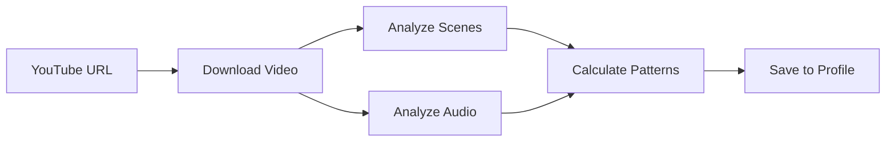
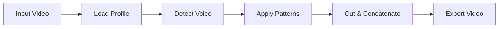

# Smart Video Editor Pro - Project Overview

## 📦 What is this?

**Smart Video Editor Pro** is a Windows desktop application that learns video editing styles from YouTube videos and automatically applies them to your own videos - completely offline!

### Key Concept

```
YouTube Video (Style to Learn) 
    ↓
[Learn Patterns] → Save to Profile
    ↓
Your Raw Video + Profile
    ↓
[Apply Patterns] → Edited Video!
```

## ✨ Features

### Phase 1 (MVP) - ✅ IMPLEMENTED

| Feature | Description | Status |
|---------|-------------|--------|
| 📥 **YouTube Downloader** | Download videos to learn from | ✅ Complete |
| 🎬 **Scene Detection** | Detect and analyze scene changes | ✅ Complete |
| 🎤 **Voice Detection** | Identify speech segments | ✅ Complete |
| 🔇 **Silence Removal** | Auto-remove quiet parts | ✅ Complete |
| 🧠 **Pattern Learning** | Learn editing styles | ✅ Complete |
| 💾 **Profile Management** | Save/load editing profiles | ✅ Complete |
| ✂️ **Video Editing** | Apply learned patterns | ✅ Complete |
| 🖥️ **GUI Interface** | User-friendly desktop app | ✅ Complete |
| 📦 **Windows Build** | Create .exe executable | ✅ Complete |

### Future Enhancements - 🔮 PLANNED

- 📝 OCR subtitle generation
- 🎨 Effect pattern recognition
- 🔄 Batch video processing
- 🌐 Community profile sharing
- 🖼️ Thumbnail generation

## 🎯 Use Cases

### 1. YouTube Content Creators
**Problem:** Spending hours editing videos manually  
**Solution:** Learn from successful creators, apply to your content  
**Result:** Faster editing with professional results

### 2. Podcasters
**Problem:** Long recordings with awkward pauses  
**Solution:** Learn from edited podcasts, remove silence automatically  
**Result:** Clean, professional-sounding episodes

### 3. Tutorial Makers
**Problem:** Inconsistent pacing and timing  
**Solution:** Learn from professional tutorials  
**Result:** Consistent, engaging educational content

### 4. Vloggers
**Problem:** Time-consuming cut and pace decisions  
**Solution:** Learn from favorite vloggers  
**Result:** Similar style without manual effort

## 🏗️ Architecture

### Three-Layer Design

```
┌──────────────────────────────────────┐
│           GUI Layer                   │
│     (PyQt5 - User Interface)         │
└──────────────────────────────────────┘
                 ↕
┌──────────────────────────────────────┐
│        Business Logic Layer           │
│   (Learning & Editing Engine)        │
└──────────────────────────────────────┘
                 ↕
┌──────────────────────────────────────┐
│         Data Layer                    │
│    (SQLite - Pattern Storage)        │
└──────────────────────────────────────┘
```

### Core Components

1. **Video Downloader** (yt-dlp)
   - Downloads YouTube videos
   - Extracts metadata

2. **Scene Detector** (OpenCV)
   - Analyzes video frames
   - Detects scene changes
   - Calculates timing patterns

3. **Audio Analyzer** (pydub)
   - Extracts audio from video
   - Detects voice segments
   - Identifies silence

4. **Style Learner**
   - Coordinates analysis
   - Extracts patterns
   - Stores in database

5. **Video Editor** (moviepy)
   - Applies learned patterns
   - Cuts and concatenates
   - Exports final video

6. **GUI** (PyQt5)
   - Learning interface
   - Editing interface
   - Progress tracking

## 📊 Workflow

### Learning Workflow



**Steps:**
1. Enter YouTube URL
2. Download video
3. Analyze scene changes (timing, frequency)
4. Analyze audio (voice, silence)
5. Calculate patterns and statistics
6. Save to database profile

### Editing Workflow



**Steps:**
1. Select video to edit
2. Choose learned profile
3. Detect voice segments
4. Apply learned thresholds
5. Remove silence with proper padding
6. Export edited video

## 📁 Project Structure

```
auto/
├── 📄 Documentation
│   ├── README.md           # Main documentation
│   ├── QUICKSTART.md       # Quick setup guide
│   ├── USAGE.md            # Detailed usage
│   ├── ARCHITECTURE.md     # Technical details
│   ├── CONTRIBUTING.md     # Contribution guide
│   └── LICENSE             # MIT License
│
├── 🔧 Configuration
│   ├── requirements.txt    # Python dependencies
│   ├── build.spec          # PyInstaller config
│   ├── build.bat           # Windows build script
│   └── setup.sh            # Unix setup script
│
├── 💻 Application
│   ├── main.py             # Entry point
│   └── src/
│       ├── core/           # Processing modules
│       │   ├── video_downloader.py
│       │   ├── scene_detector.py
│       │   ├── audio_analyzer.py
│       │   ├── style_learner.py
│       │   └── video_editor.py
│       ├── database/       # Data layer
│       │   └── models.py
│       └── gui/            # User interface
│           └── main_window.py
│
├── 🧪 Testing
│   ├── demo.py             # Demo script
│   └── test_basic.py       # Unit tests
│
└── 💾 Data
    ├── profiles/           # Saved profiles
    └── temp/               # Temp files
```

## 🚀 Quick Start

### 3 Commands to Get Started

```bash
# 1. Install dependencies
pip install -r requirements.txt

# 2. Run application
python main.py

# 3. Start editing!
```

### First Editing Session (15 minutes)

1. **Learn** (5 min)
   - Find YouTube video
   - Download & analyze
   - Save profile

2. **Edit** (10 min)
   - Load your video
   - Select profile
   - Process & export

## 🎓 Learning Curve

| Level | Time | Skills Needed | What You'll Learn |
|-------|------|---------------|-------------------|
| Beginner | 15 min | None | Basic usage |
| Intermediate | 1 hour | Basic video editing | Multiple profiles, optimization |
| Advanced | 3 hours | Python basics | Customization, troubleshooting |
| Expert | 5+ hours | Python, video processing | Contribution, extension |

## 📈 Performance

| Video Length | Processing Time | Output Quality |
|--------------|-----------------|----------------|
| 5 minutes | ~10-15 min | Same as input |
| 10 minutes | ~20-30 min | Same as input |
| 30 minutes | ~60-90 min | Same as input |
| 1 hour | ~2-3 hours | Same as input |

**Note:** First download takes longer; learning is one-time per style.

## 🛠️ Technology Stack

| Component | Technology | Purpose |
|-----------|-----------|---------|
| Language | Python 3.8+ | Core implementation |
| GUI | PyQt5 | Desktop interface |
| Video | moviepy | Video I/O & editing |
| Vision | OpenCV | Scene detection |
| Audio | pydub | Audio analysis |
| Download | yt-dlp | YouTube downloader |
| Database | SQLAlchemy | Pattern storage |
| Build | PyInstaller | Executable creation |

## 🎯 Success Metrics

**For Users:**
- ✓ 50-70% time savings on editing
- ✓ Consistent editing quality
- ✓ Professional results without expertise

**For Developers:**
- ✓ Modular, maintainable code
- ✓ Comprehensive documentation
- ✓ Easy to extend and customize

## 🤝 Contributing

We welcome contributions! See [CONTRIBUTING.md](CONTRIBUTING.md) for details.

### Ways to Contribute

- 🐛 Report bugs
- 💡 Suggest features
- 📝 Improve documentation
- 🔧 Submit code
- 🧪 Add tests
- 🎨 Improve UI/UX

## 📞 Support

- **Documentation**: README.md, USAGE.md, QUICKSTART.md
- **Issues**: GitHub Issues
- **Discussions**: GitHub Discussions
- **Email**: See repository

## 📜 License

MIT License - Free to use, modify, and distribute.

See [LICENSE](LICENSE) for details.

## 🎉 Acknowledgments

Built with amazing open-source tools:
- yt-dlp, moviepy, OpenCV, PyQt5, pydub, SQLAlchemy

## 🔮 Roadmap

### v1.0 (Current) - MVP
- ✅ Core features implemented
- ✅ Basic GUI
- ✅ Profile management

### v1.1 (Next)
- 🔄 Better error handling
- 🔄 Progress improvements
- 🔄 More file formats

### v2.0 (Future)
- 📝 OCR subtitles
- 🎨 Effect recognition
- 🔄 Batch processing

### v3.0 (Vision)
- 🌐 Cloud profiles
- 🤖 ML improvements
- 🎬 Advanced features

---

**Ready to automate your video editing?** Let's get started! 🚀

Check [QUICKSTART.md](QUICKSTART.md) for setup instructions.
